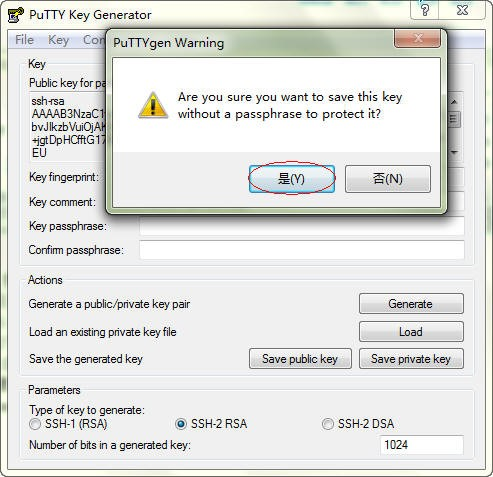

今天同学给我一个 Putty 远程登录使用的 ppk 文件（即后缀名为 ppk）让我远程登录主机，但是我用的是 Xshell，导入这个 ppk 文件时，遇到 “Failed to import the user key!” 错误。现在我们就来解决一下。

<!--more-->

## 错误截图

这个错误表明导入的 private key 文件不是 XShell 所支持的，初步猜测有三种可能：

1. 将 Public Key 当成 Private Key 导入。
2. 使用 Putty 的 ppk 文件。
3. Key 文件有多种格式（SSH1-RSA, SSH2-RSA, SSH2-DSA, SSH.COM, OPENSSH2-RSA, OPENSSH2-DSA, PPK, SSH2-IETF SECSH [RSA,DSA]），目前看来 XShell 支持 SSH1-RSA, OpenSSH2-RSA, OpenSSH2-DSA, SSH.COM, NetSarang User Key。所以如果使用了标准的 SSH2-RSA, SSH2-DSA 这两种 PrivateKey 的同学请试着转换为 OpenSSH 格式（Tools->Convert Private Key to OpenSSH Format）后再导入。

## 解决方法

1. 找到 Putty 安装目录下的 PUTTYGEN.EXE，打开它，选择 “Conversions”->“Import key”，选择要导入的 ppk 文件。导入后，下面的 “Export OpenSSH key” 选项由灰色变成可用状态，点击它，导出一个自己命名的文件，这个文件默认没有后缀名。导出时提示没有设置密码，点击 “是” 或者自己设置一个密码吧。

现在导出的这个文件就是 Xshell 登录需要的文件了。

2. 在 Xshell 中新建一个 Session 或修改已有的 Session 配置（Properties），找到 “Connection”->“Authentication”，Method 选择 “Public Key”，User Name 填写要登录的用户名，点击 Browse 按钮，然后 Import 刚才 Putty 导出的文件，由于这个文件我们刚才没有设置密码，所以 Passphrase 不用填，完成后如下。这样就由使用 Putty 登录转成使用自己熟悉的 Xshell 登录了。

## 总结

XShell 可以生成 OPENSSH2-RSA, OPENSSH2-DSA, SSH2-IETF SECSH (RSA,DSA) 这几种格式的 KEY 文件并能识别，并能互相转换。SecucreCRT 可以生成 SSH1-RSA, SSH2-RSA, OPENSSH2-RSA, OPENSSH2-DSA 这几种格式的 KEY 文件，并能互相转换。PuttyGEN 可以生成 SSH1-RSA, PPK, OPENSSH2-RSA, OPENSSH2-DSA, SSH.COM 格式的 KEY 文件，除了 SSH1 格式都能进行互相转换。不过如果遇到如下报错，请更新你的 puttygen.exe 即可。[Couldn’t load private key (ciphers other than DES-EDE3-CBC not supported)](http://winscp.net/forum/viewtopic.php?t=8324)
由此可见 OPENSSH2 格式的 key 文件比较通用一些。
