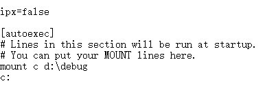

最近在学微机原理，用到了汇编语言，也用到了 debug，不过在 64 位的 Windows 中，没有内置 debug，这里我们用 DOSBox 和 debug 解决。

## 没有 debug 的原因

64 位 windows 没有内置 ntvdm，因为 64 位 cpu 不支持 V8086，而 ntvdm 依赖 V8086。debug 又依赖 ntvdm，所以 64 位系统没有 debug。64 位下需要 ntvdm 的话，可以用 dosbox，而 debug 可以从 32 位的电脑上复制，不过我已经在下面给大家准备好了。

## debug 下载

这是我上传到百度网盘的[debug 下载](http://pan.baidu.com/s/1bprTmkZ)，密码：exi0。

## DOSBox 下载

大家可以去[DOSBox 官网](http://www.dosbox.com/)下载，查看详细的文件
也可以直接下载我上传到百度网盘的[DOSBox](http://pan.baidu.com/s/1c11Kxn6)，密码：syf7。

## 安装 DOSBox

把 DOSBOX 安装之后打开安装文件夹，找到 DOSBox 0.74 Options.bat , 然后双击打开，找到最后一行`# You can put your MOUNT lines here.`，加入以下内容:

``` cmd
mount c d:\debug
c:
```



在 D 盘的根目录下新建 debug 文件夹，把之前下载的 dubug 放入其中。
启动 DOSBox, 输入 debug，就可以使用了:


